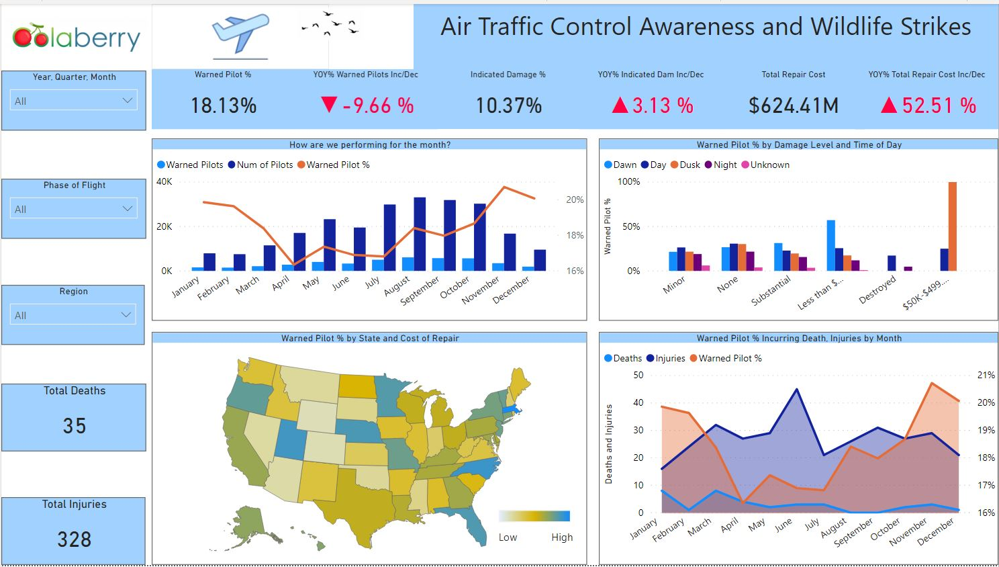

# Air Traffic Control Awareness and Wildlife Strikes

## Project Summary

It's a bird! It's a plane! Ever wonder what was the cause of the Miracle on the Hudson? In this dashboard we look at what the effect of a well informed warned pilot vs. a uninformed warned pilot has in helping control damage cost, as well as keeping guests on their planes safe during flight.

---

## Business Problem

Organizations need clear analytics outputs that transform raw project data into actionable insights for better decision-making.

---

## Objective

- Analyze datasets and build machine learning workflows to identify predictive patterns.
- Prepare and transform data for model training, evaluation, and forecasting tasks.
- Present AI and machine learning insights in a professional portfolio-ready format.

---

## Tools & Technologies

- Python
- Pandas
- Machine Learning
- Forecasting
- Data Analytics

---

## Project Workflow

- Prepared and cleaned the dataset for machine learning analysis.
- Explored data patterns and feature relationships.
- Built predictive or analytical models using Python-based workflows.
- Evaluated model performance and analytical outputs.
- Documented findings and business recommendations.

---

## Key Insights

- Prepared project data for forecasting and machine learning analysis workflows.
- Identified patterns and trends that support predictive analytics and business planning.
- Structured project outputs into clear analytics deliverables and reporting assets.
- Presented findings in a recruiter-friendly portfolio format.

---

## Final Dashboard / Project Preview

---

## Business Impact

- Supports predictive analytics and data-driven forecasting workflows.
- Improves business visibility through AI-driven trend and pattern analysis.
- Demonstrates practical machine learning and predictive analytics skills.

---

## Portfolio Navigation

[← Back to Portfolio Home](../README.md)
